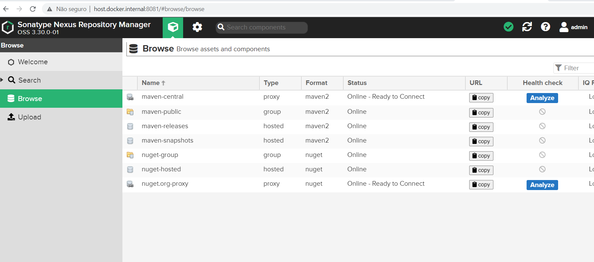
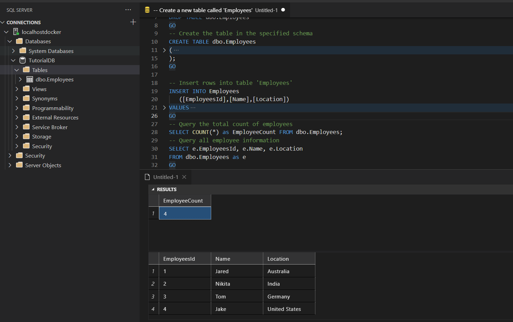
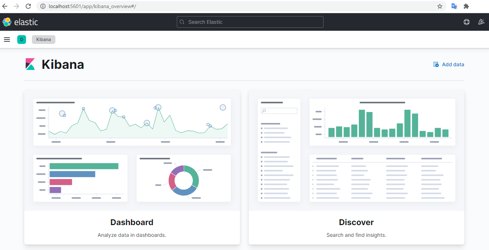
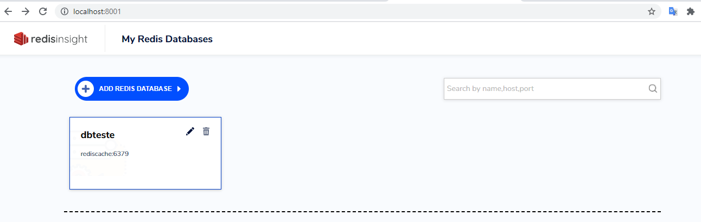
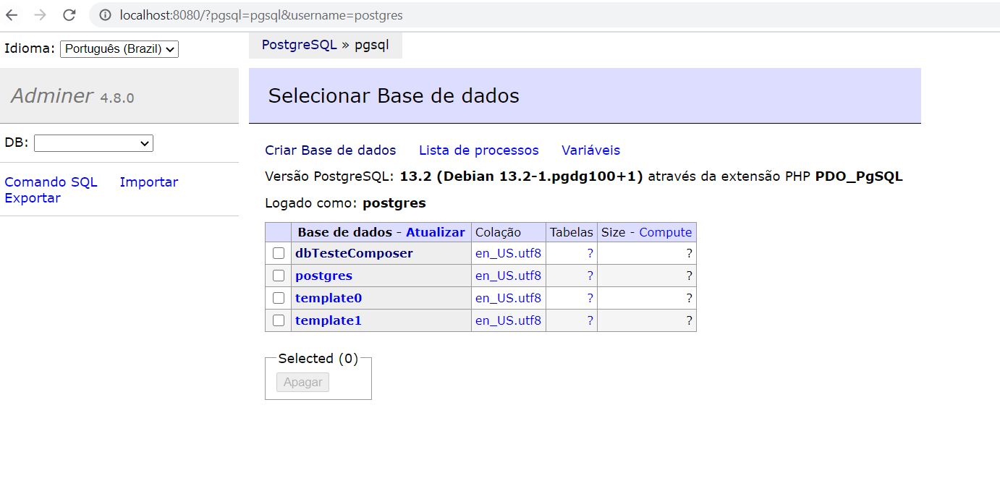
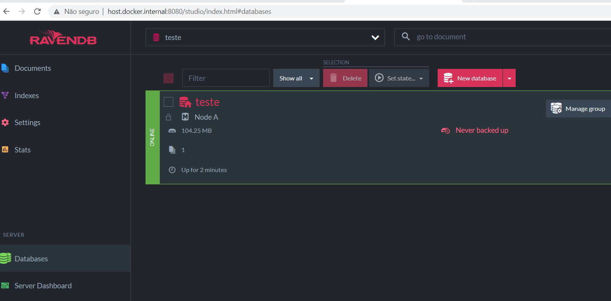

# Docker composers
This is where we can save our docker composers to use when we want!

You can use this composers to help you developement on localhost with all this without needing to install the 
application on your machine, you just need [Docker](https://www.docker.com/get-started) and [Docker-Compose](https://docs.docker.com/compose/)

### Composers List
- [Nexus](#nexus)
- [Sql Server](#sql-server)
- [Postgres with Adminer](#postgres-with-adminer)
- [RavenDb](#ravendb)
- [Redis with RedisInsight](#redis-with-redisinsight)
- [RabbitMQ](#rabbitmq)

# Applications

### Nexus

[help-nexus](Nexus/help.md)

### Sql Server

[help-sqlserver](SqlServer/help.md)

### ElasticSearch and Kibana

[help-elastickibana](ElasticKibana/help.md)

### Redis with RedisInsight

[help-redis](Redis/help.md)

### RabbitMQ

[help-rabbitmq](RabbitMq/help.md)

### Postgres with Adminer

[help-psql](Postgres/help.md)

### RavenDb

[help-raven](RavenDb/help.md)


# Contribute
Fell free to contribute just forking this repository and sending a pull request with a docker compose from any 
application to help us to developer.

You must create a folder with this structure:

```bash
FolderAppName
├── appname-docker-compose.yml
├── help.md
├── appName.png
```

You can see the [Nexus](Nexus) folder to get an example.

There's a `help-Template.md` to help you when you go to write about the app.
