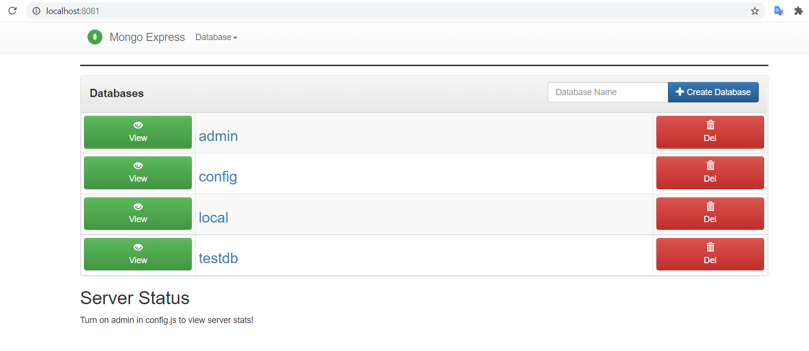
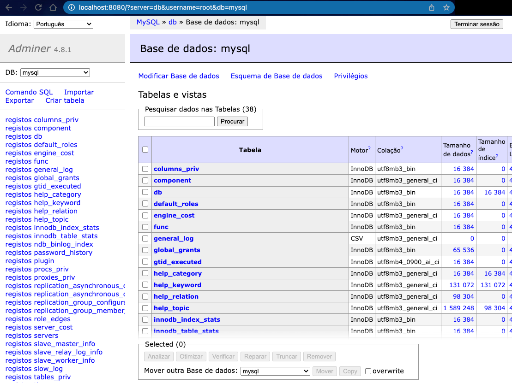

# Docker composers

> RUN YOUR SERVICES ON LOCALHOST WITH JUST [Docker](https://www.docker.com/get-started) and [Docker-Compose](https://docs.docker.com/compose/)

#### You can use this composers to help your daily developement with your services on localhost without needing to install it!!

### Composers List
- [RabbitMQ](#rabbitmq)
- [Mongodb with MongoExpress](#mongodb-with-mongo-express)
- [Redis with RedisInsight](#redis-with-redisinsight)
- [ElasticSearch and Kibana](#elasticsearch-and-kibana)
- [RavenDb](#ravendb)
- [Sql Server](#sql-server)
- [MySQL with Adminer](#mysql-with-adminer)
- [Postgres with Adminer](#postgres-with-adminer)
- [Nexus](#nexus)

# Applications

### RabbitMQ

[help-rabbitmq](RabbitMq/README.md)

### Mongodb with Mongo-Express

[help-mongo](Mongodb/README.md)

### Redis with RedisInsight

[help-redis](Redis/README.md)

### ElasticSearch and Kibana

[help-elastickibana](ElasticKibana/README.md)

### RavenDb

[help-raven](RavenDb/README.md)

### Sql Server

[help-sqlserver](SqlServer/README.md)

### Postgres with Adminer

[help-psql](Postgres/README.md)

### MySQL with Adminer

[help-mysql](MySQL/README.md)

### Nexus

[help-nexus](Nexus/README.md)


# Contribute
Fell free to contribute just forking this repository and sending a pull request with a docker compose from any 
application to help us to developer.

You must create a folder with this structure:

```bash
FolderAppName
├── appname-docker-compose.yml
├── README.md
├── appName.png
```

You can see the [Nexus](Nexus) folder to get an example.

There's a `help-Template.md` to help you when you go to write about the app.
